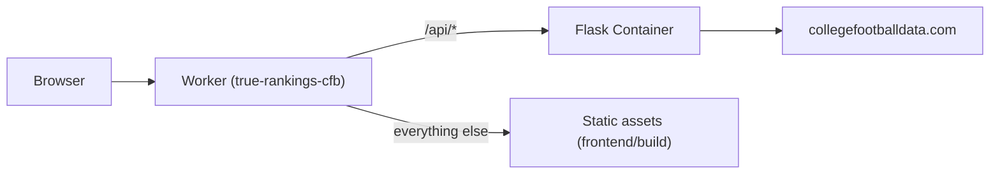

# Deploy to Cloudflare Workers

**Goal:** One Worker deploy for the whole app — static SvelteKit frontend + Flask API container. Production secrets live **in Cloudflare**, not GitHub or Cursor.

See also: [SECRETS.md](./SECRETS.md)

---

## Architecture



| Path | Handled by |
|------|------------|
| `/api/*` | Worker → Cloudflare Container (Flask) |
| `/`, `/methodology`, etc. | Static assets (SPA fallback to `index.html`) |
| `/rankings/2024/*.json` | Static precomputed rankings |

One `wrangler deploy` uploads **both** the frontend build and the API container image.

---

## Environments (dev + prod)

**You only need one production Worker to start.** Dev is optional.

| | Production (required) | Dev (optional) |
|---|------------------------|----------------|
| **When** | Live site on `main` | Staging / testing before prod |
| **Worker name** | `true-rankings-cfb` | `cfb-rankings-dev` |
| **URL** | `https://true-rankings-cfb.<account>.workers.dev` | `https://cfb-rankings-dev.<account>.workers.dev` |
| **How** | Workers Builds on `main` (automatic) or `npm run deploy` | Manual `npm run deploy:dev` only if you want a second Worker |

**Workers Builds (recommended):**
- **Production branch** (`main`) → deploys `true-rankings-cfb` automatically
- **Other branches** → preview versions (`wrangler versions upload`) on the same Worker — no second Worker required

You do **not** need two Workers unless you want a permanently separate staging URL with its own secrets.

---

## Secrets (dashboard — no CLI required)

`wrangler secret put` is optional. Prefer the dashboard:

1. **Workers & Pages** → `true-rankings-cfb` → **Settings** → **Variables and Secrets**
2. **Add** → type **Secret** → name `CFBD_API_KEY` → paste value → **Encrypt** → **Deploy**

Repeat for `MINIMAX_API_KEY` / `CACHE_CLEAR_SECRET` if needed. Values are encrypted and never shown again.

For `cfb-rankings-dev` (only if you use the dev Worker): same steps on that Worker, or use `wrangler secret put CFBD_API_KEY --env dev` once.

---

## Workers Builds settings (Cloudflare dashboard)

**Settings → Build** on your Worker:

| Setting | Value |
|---------|-------|
| Production branch | `main` |
| Build command | `npm run build` |
| Deploy command | `npx wrangler deploy --env=""` |
| API token | Custom token with **Containers** edit (see below) |

Root `npm ci` runs `postinstall`, which installs `frontend/` and `worker/` deps. The `build` script also runs `npm ci --prefix frontend` before `vite build` so the build still works if `postinstall` is skipped (e.g. cached install).

Use **Node.js 22+** (`.nvmrc` in repo root). Wrangler 4.119+ requires Node 22; Node 20 will fail at deploy with `Wrangler requires at least Node.js v22.0.0`.

### Builds API token (required for Containers)

The default **Create new token** for Workers Builds only grants Workers Scripts / KV / R2 — **not Containers**. This Worker builds a Docker image and pushes it to Cloudflare’s container registry during `wrangler deploy`. Without Containers permission, deploy ends with a bare:

```text
✘ [ERROR] Unauthorized
Failed: error occurred while running deploy command
```

after the image has already built successfully (assets + Worker script may already be uploaded).

Fix:

1. **My Profile → API Tokens → Create Token** (or edit the Builds token).
2. Include at least:
   - Account → **Workers Scripts** → Edit
   - Account → **Workers Containers** / Containers → Edit (wording varies in the UI)
   - Account → **Account Settings** → Read (Builds default)
   - Zone → **Workers Routes** → Edit (if you use custom domains)
3. On the Worker → **Settings → Builds** → select that token as the Builds **API token**.
4. Set Deploy command to `npx wrangler deploy --env=""` (avoids the multi-env warning; top-level prod config).
5. Re-run the failed build (or push an empty commit).

Confirm Workers **Paid** is enabled — Containers are Paid-only.

**Runtime secrets** (for the live app): **Settings → Variables and Secrets** (not Build Variables).

| Secret | Required |
|--------|----------|
| `CFBD_API_KEY` | Yes (live rankings) |
| `MINIMAX_API_KEY` | Optional (`AI_MODE=live`) |
| `CACHE_CLEAR_SECRET` | Optional (protects `POST /api/cache/clear`) |

---

## One-time setup (local deploy alternative)

### Prerequisites (local deploy only)

- Cloudflare account with **Workers Paid** plan (required for Containers)
- Docker running locally (for `wrangler deploy` to build the API image)
- `wrangler login` once on your machine

### Deploy locally

```bash
npm ci   # installs root, frontend, and worker via postinstall
npm run deploy          # production
npm run deploy:dev      # optional second Worker
```

First deploy builds the Docker image and can take several minutes. The Worker may not serve traffic until containers are provisioned (~2–5 min).

### Verify

```bash
WORKER_URL="https://true-rankings-cfb.<account>.workers.dev"
curl -sf "${WORKER_URL}/"
curl -sf --max-time 120 "${WORKER_URL}/api/rankings?year=2024&week=10" | head -c 200
```

Open the Worker URL in a browser — rankings for 2024 should load.

### 5. Connect GitHub (optional CI deploy)

**Workers & Pages** → **Workers** → **Create** → connect this repo, or use GitHub Actions:

Repository variables:
- `ENABLE_CLOUDFLARE_DEPLOY` = `true`
- `WORKER_URL` = your production Worker URL (for smoke tests)

Repository secrets:
- `CLOUDFLARE_API_TOKEN`
- `CLOUDFLARE_ACCOUNT_ID`

---

## Custom domain (Porkbun → Cloudflare)

Porkbun has no Cloudflare integration — DNS is manual.

### Recommended: Cloudflare DNS

1. Add your domain to Cloudflare; point Porkbun nameservers at Cloudflare
2. Worker → **Settings → Domains & Routes** → **Add** → **Custom Domain** → e.g. `rankings.yourdomain.com`
3. Cloudflare creates DNS records automatically

### Keep DNS at Porkbun

Worker → **Domains & Routes** → note the custom domain target, then at Porkbun add a **CNAME** for your subdomain.

After custom domain is live, set the `CORS_ORIGINS` secret to your domain.

---

## Local development

```bash
CFBD_OFFLINE=1 AI_MODE=stub ./venv/bin/python app.py   # :5001
cd frontend && npm run dev                              # :5173, proxies /api
```

---

## CI/CD

| Workflow | Role |
|----------|------|
| `ci.yml` | Lint, test, build — blocks merges |
| `deploy-cloudflare.yml` | Build + deploy when `ENABLE_CLOUDFLARE_DEPLOY=true` |

### Planned

- Playwright E2E against `cfb-rankings-dev.*.workers.dev`
- Impeccable frontend audit in CI
- Auto-promote dev → prod after tests pass

---

## Troubleshooting

For an agent-driven watch/fix loop (parse logs → patch → push → retry), use the **cloudflare-deploy-watch** skill at `docs/skills/cloudflare-deploy-watch/SKILL.md` (copy to `.cursor/skills/` locally if you want Cursor to auto-load it).

| Symptom | Fix |
|---------|-----|
| `Invalid _headers configuration` on deploy | Fix `frontend/static/_headers` — use path + indented headers only; no C-style `/* comment */` blocks |
| `vite: not found` on build | Ensure root `postinstall` and `build` install `frontend/` deps |
| `Unauthorized` after Docker image build in Workers Builds | Builds API token lacks Containers edit — see [Builds API token](#builds-api-token-required-for-containers) |
| Multi-env warning, wrong Worker updated | Deploy command must be `npx wrangler deploy --env=""` |
| API 503 right after first deploy | Wait 2–5 min for container provisioning |
| Cold `/api/rankings` slow | Expected; use static 2024 JSON for UI work |
| `wrangler deploy` fails locally | Ensure Docker is running; `wrangler login` or valid `CLOUDFLARE_API_TOKEN` with Containers |
| CORS errors on custom domain | Set `CORS_ORIGINS` secret on the Worker |

---

## Cursor Cloud vs Cloudflare

| Place | Role |
|-------|------|
| **Cloudflare secrets** | Live production (and dev) Worker |
| **Cursor Secrets tab** | Cloud Agent VM only — [.cursor/SECRETS.md](../.cursor/SECRETS.md) |
| **GitHub secrets** | CI deploy tokens only |

Setting a key in Cursor does **not** deploy it to Cloudflare.
