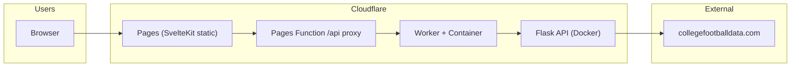

# Deploy to Cloudflare

**Goal:** Frontend on **Cloudflare Pages**, API on **Cloudflare Containers** (Flask in Docker). Production secrets live **in Cloudflare**, not GitHub or Cursor.

See also: [SECRETS.md](./SECRETS.md)

---

## Architecture



| Component | Service | URL pattern |
|-----------|---------|-------------|
| Frontend | Cloudflare Pages | `cfb-rankings.pages.dev` or your custom domain |
| API (prod) | Worker + Container | `cfb-rankings-api.<account>.workers.dev` |
| API (dev) | Worker + Container (`--env dev`) | `cfb-rankings-api-dev.<account>.workers.dev` |

---

## Environments (dev + prod)

| Layer | Production | Dev / preview |
|-------|------------|---------------|
| **Pages** | `main` branch → Production deployment | Every PR/branch → Preview URL |
| **Pages `API_ORIGIN`** | `https://cfb-rankings-api.<account>.workers.dev` | `https://cfb-rankings-api-dev.<account>.workers.dev` |
| **API Worker** | `wrangler deploy` (default) | `wrangler deploy --env dev` |
| **API secrets** | Cloudflare → `cfb-rankings-api` | Cloudflare → `cfb-rankings-api-dev` |

Pages preview deployments are built-in — no extra infra. Set **different `API_ORIGIN` values** for Production vs Preview in the Pages dashboard so preview sites hit the dev API.

---

## One-time setup

### 1. Cloudflare account

Log in at [dash.cloudflare.com](https://dash.cloudflare.com). Containers require a **Workers Paid** plan.

### 2. Connect GitHub → Pages (frontend)

1. **Workers & Pages** → **Create** → **Pages** → **Connect to Git**
2. Authorize the Cloudflare GitHub App
3. Select this repository

| Setting | Value |
|---------|-------|
| Production branch | `main` |
| Root directory | `frontend` |
| Build command | `npm ci && npm run build` |
| Build output | `build` |
| Node version | `20` |

### 3. Pages environment variables

**Settings → Variables and Secrets** → add `API_ORIGIN` (plain text, not secret):

| Environment | Variable | Example value |
|-------------|----------|---------------|
| Production | `API_ORIGIN` | `https://cfb-rankings-api.<account>.workers.dev` |
| Preview | `API_ORIGIN` | `https://cfb-rankings-api-dev.<account>.workers.dev` |

The Pages Function at `frontend/functions/api/[[path]].ts` proxies `/api/*` to this origin.

### 4. Deploy the API (Containers)

On a machine with Docker and `wrangler login`:

```bash
cd worker && npm ci

# Production API
npx wrangler deploy --config ../wrangler.toml

# Dev API (optional)
npx wrangler deploy --config ../wrangler.toml --env dev
```

First deploy builds the Docker image and can take several minutes. The Worker may not serve traffic until the container is provisioned (~2–5 min).

Set secrets on each API service:

```bash
npx wrangler secret put CFBD_API_KEY
npx wrangler secret put MINIMAX_API_KEY      # optional
npx wrangler secret put CACHE_CLEAR_SECRET   # optional

# Dev environment
npx wrangler secret put CFBD_API_KEY --env dev
```

Or: Dashboard → Worker → **Settings → Variables and Secrets**.

| Secret | Required |
|--------|----------|
| `CFBD_API_KEY` | Yes (live rankings) |
| `MINIMAX_API_KEY` | Optional (`AI_MODE=live`) |
| `CACHE_CLEAR_SECRET` | Optional (protects `POST /cache/clear`) |

### 5. Verify

```bash
API_URL="https://cfb-rankings-api.<account>.workers.dev"
curl -sf "${API_URL}/"
curl -sf --max-time 120 "${API_URL}/rankings?year=2024&week=10" | head -c 200
```

Open your Pages URL, pick year/week 2024 — rankings should load via `/api` proxy.

---

## Custom domain (Porkbun → Cloudflare)

Porkbun has no official Cloudflare integration; DNS is manual (or via Porkbun API). Recommended path:

### Option A — Cloudflare DNS (recommended)

1. In Cloudflare: **Add site** → enter your domain → follow import/NS instructions
2. At Porkbun: change nameservers to the two Cloudflare nameservers
3. In **Pages** → your project → **Custom domains** → add `rankings.yourdomain.com` (or apex)
4. Cloudflare creates the DNS records automatically when using Cloudflare DNS

### Option B — Keep DNS at Porkbun

1. Pages → **Custom domains** → add domain → note the CNAME target (e.g. `cfb-rankings.pages.dev`)
2. Porkbun → DNS → add **CNAME**: `rankings` → `cfb-rankings.pages.dev`
3. For API subdomain: Worker → **Domains & Routes** → add `api.yourdomain.com`

| Host | Type | Target |
|------|------|--------|
| `rankings` (or `@`) | CNAME | `<pages-project>.pages.dev` |
| `api` | CNAME | `cfb-rankings-api.<account>.workers.dev` |

After custom domain is live, set `CORS_ORIGINS` secret on the API Worker to your Pages origin(s).

---

## CI/CD (GitHub Actions)

| Workflow | Role |
|----------|------|
| `ci.yml` | Lint, test, build — **blocks merges** |
| `deploy-cloudflare.yml` | Validates Pages build; optionally deploys API |

**Pages deploys automatically** when Cloudflare Git integration builds `main`. GitHub Actions does not push to Pages.

### Optional: automated API deploy

Repository **Settings → Secrets and variables → Actions**:

| Secret / variable | Purpose |
|-------------------|---------|
| `CLOUDFLARE_API_TOKEN` | `wrangler deploy` from CI |
| `CLOUDFLARE_ACCOUNT_ID` | Account ID |
| `ENABLE_CLOUDFLARE_CONTAINERS` = `true` | Enable API deploy job |
| `DEPLOY_CLOUDFLARE_DEV` = `true` | Also deploy `--env dev` |
| `API_URL` | Smoke test target after deploy |

Set the same API secrets in Cloudflare (not GitHub) for runtime.

### Future: Playwright + Impeccable in CI

Planned pipeline extension (not yet wired):

1. `ci.yml` — unit tests (current)
2. Preview deploy — Cloudflare Pages preview per PR
3. Playwright against preview URL + static 2024 weeks
4. Impeccable frontend audit (local/Cursor skill; not in repo ship)
5. Merge → production Pages + API deploy

---

## Local development

```bash
# Terminal 1 — API
CFBD_OFFLINE=1 AI_MODE=stub ./venv/bin/python app.py

# Terminal 2 — frontend (Vite proxies /api → :5001)
cd frontend && npm run dev
```

---

## Hybrid cutover (Render fallback)

Until the Container API is live, `frontend/static/_redirects` still points at Render as a fallback for static previews without Pages Functions. Once the Cloudflare API is verified:

1. Set `API_ORIGIN` in Pages (Production + Preview)
2. Remove or update the Render line in `_redirects`
3. Set `autoDeploy: false` on Render (already in `render.yaml`)

---

## Troubleshooting

| Symptom | Fix |
|---------|-----|
| Pages shows "API_ORIGIN is not configured" | Set `API_ORIGIN` in Pages → Variables for that environment |
| API 503 right after first deploy | Wait 2–5 min for container provisioning |
| Cold `/rankings` slow | Expected; use static `frontend/static/rankings/2024/` for UI work |
| CORS errors with custom domain | Set `CORS_ORIGINS` secret on API Worker |
| `wrangler deploy` fails on Docker | Ensure Docker daemon is running locally or in CI |

---

## Cursor Cloud vs Cloudflare

| Place | Role |
|-------|------|
| **Cloudflare secrets** | Live production (and dev) API |
| **Cursor Secrets tab** | Cloud Agent VM only — [.cursor/SECRETS.md](../.cursor/SECRETS.md) |
| **GitHub secrets** | CI deploy tokens only; not app API keys |

Setting a key in Cursor does **not** deploy it to Cloudflare.
