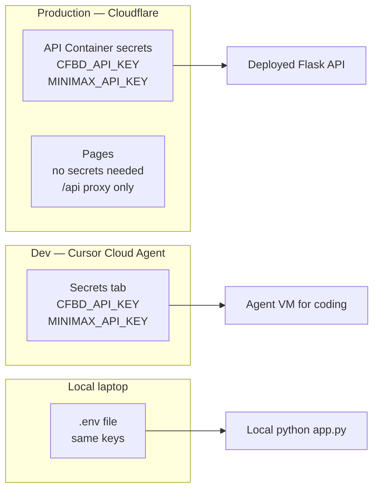

# Secrets architecture

Three places, three jobs. **Production secrets live in Cloudflare.**



## Source of truth by environment

| Environment | Where secrets live | What for |
|-------------|-------------------|----------|
| **Production (deployed app)** | **Cloudflare** — Container/Worker secrets | The live API that users hit |
| **Cursor Cloud Agent** | Cursor Secrets tab | Spinning up the app *while coding* in the agent VM |
| **Your laptop** | `.env` (gitignored) | Local `python app.py` |

You are correct: once the app is deployed, Cloudflare should hold the production keys. Cursor secrets are only so the Cloud Agent can run the API during development — they are **not** a substitute for Cloudflare production secrets.

---

## Production: put secrets in Cloudflare

### API (Cloudflare Containers / Workers)

Dashboard → your API service → **Settings → Variables and Secrets** → **Add secret**:

| Secret | Required? | Purpose |
|--------|-----------|---------|
| `CFBD_API_KEY` | **Yes** | Fetch game data from College Football Data |
| `MINIMAX_API_KEY` | Optional | `/agent/explain` ranking explanations |
| `CACHE_CLEAR_SECRET` | Optional | Enable admin `POST /cache/clear` |
| `CORS_ORIGINS` | Optional | Restrict CORS to your Pages domain |

Or via CLI (after `wrangler login` once on your machine):

```bash
wrangler secret put CFBD_API_KEY
wrangler secret put MINIMAX_API_KEY   # optional
```

These bind into the container process as environment variables. The Flask app already reads them via `os.getenv` / `load_dotenv()`.

### Frontend (Cloudflare Pages)

**No API keys.** The static SPA never needs `CFBD_API_KEY` or `MINIMAX_API_KEY`. It calls `/api/*` on the same origin; Cloudflare proxies to the API (`frontend/static/_redirects`).

Do **not** put MiniMax or CFBD keys in Pages environment variables — they would be baked into or visible to the browser build.

---

## Dev-only: Cursor Secrets tab

While a Cloud Agent is coding and needs to *run* the API in the VM, add the same keys in Cursor:

→ [.cursor/SECRETS.md](../.cursor/SECRETS.md)

That does **not** deploy them to Cloudflare. After you deploy, set them again (once) in Cloudflare as above.

---

## What about GitHub secrets?

| Secret in GitHub | Needed? |
|------------------|---------|
| `CFBD_API_KEY` | Only if CI must hit the live CFBD API (optional for unit tests — tests mock the API) |
| Production MiniMax / Cloudflare tokens | **No** — keep those in Cloudflare |

Prefer: GitHub CI uses mocks / no live keys. Production keys only in Cloudflare.

---

## Mental model

1. **Deploy the app to Cloudflare** (Pages Git integration + Containers).
2. **Paste secrets once in the Cloudflare dashboard** for the API service.
3. Use Cursor Secrets only when you want the Cloud Agent to run the stack during development.
4. Never commit secrets; never put API keys in the frontend.
