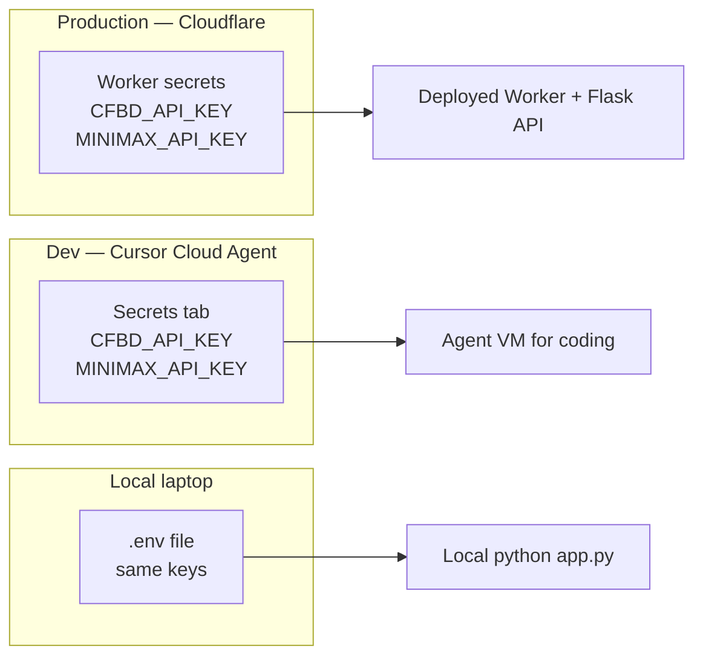

# Secrets architecture

Three places, three jobs. **Production secrets live in Cloudflare.**



## Source of truth by environment

| Environment | Where secrets live | What for |
|-------------|-------------------|----------|
| **Production (deployed app)** | **Cloudflare** — Container/Worker secrets | The live API that users hit |
| **Cursor Cloud Agent** | Cursor Secrets tab | Spinning up the app *while coding* in the agent VM |
| **Your laptop** | `.env` (gitignored) | Local `python app.py` |

You are correct: once the app is deployed, Cloudflare should hold the production keys. Cursor secrets are only so the Cloud Agent can run the API during development — they are **not** a substitute for Cloudflare production secrets.

---

## Production: put secrets in Cloudflare

### API (Cloudflare Containers / Workers)

Dashboard → your API service → **Settings → Variables and Secrets** → **Add secret**:

| Secret | Required? | Purpose |
|--------|-----------|---------|
| `CFBD_API_KEY` | **Yes** | Fetch game data from College Football Data |
| `MINIMAX_API_KEY` | Optional | `/agent/explain` ranking explanations |
| `CACHE_CLEAR_SECRET` | Optional | Enable admin `POST /cache/clear` |
| `CORS_ORIGINS` | Optional | Restrict CORS to your Worker custom domain |

Or via CLI (after `wrangler login` once on your machine):

```bash
wrangler secret put CFBD_API_KEY
wrangler secret put MINIMAX_API_KEY   # optional
```

These bind into the container process as environment variables. The Flask app already reads them via `os.getenv` / `load_dotenv()`.

### Frontend (Cloudflare Worker static assets)

**No API keys.** The SPA calls `/api/*` on the same origin; the Worker routes API traffic to the Flask container (`wrangler.toml` → `run_worker_first`).

Do **not** put MiniMax or CFBD keys in Worker `vars` visible to the client build.

---

## Dev-only: Cursor Secrets (not environment.json)

While a Cloud Agent is coding and needs to *run* the API in the VM, add the same keys in Cursor:

→ [.cursor/SECRETS.md](../.cursor/SECRETS.md)

**Important:** this repo’s Cloud Agent environment is driven by `.cursor/environment.json` (repo-file). That environment’s dashboard page often has **no Secrets UI**. Add `CFBD_API_KEY` / `MINIMAX_API_KEY` as **Personal or Team Runtime Secrets** on the main [Cloud Agents](https://cursor.com/dashboard/cloud-agents) Secrets page — the same place `CFBD_API_KEY` already comes from. Do not put secrets in `environment.json`.

That does **not** deploy them to Cloudflare. After you deploy, set them again (once) in Cloudflare as above.

---

## Local spend guards

| Variable | Local default | Purpose |
|----------|---------------|---------|
| `CFBD_OFFLINE=1` | Yes in development | Block live CFBD HTTP; use `.cache/` + `frontend/static/rankings/` |
| `CFBD_MAX_CALLS` | **25** in development if unset | Hard cap if you turn CFBD on |
| `AI_MODE=stub` | Yes in development | Template explanations; **no MiniMax** |
| `AI_MODE=off` | Production default | `explanation: null` + structured context only |
| `AI_MODE=live` | Opt-in | Paygo MiniMax key only — **not** Coding Plan / OpenCode |
| `AI_MAX_CALLS` | **25** in development if unset | Hard cap on live MiniMax prompts per process |
| `AGENT_RATE_LIMIT` | 50/hour in development | Per-IP cap on `/agent/explain` |

Free CFBD tier is **1,000 calls/month**. Prefer static 2024 weeks for UI work.
`GET /agent/health` returns current spend counters.

---

## What about GitHub secrets?

| Secret in GitHub | Needed? |
|------------------|---------|
| `CFBD_API_KEY` | Only if CI must hit the live CFBD API (optional for unit tests — tests mock the API) |
| Production MiniMax / Cloudflare tokens | **No** — keep those in Cloudflare |

Prefer: GitHub CI uses mocks / no live keys. Production keys only in Cloudflare.

---

## Mental model

1. **Deploy the app to Cloudflare** (Pages Git integration + Containers).
2. **Paste secrets once in the Cloudflare dashboard** for the API service.
3. Use Cursor Secrets only when you want the Cloud Agent to run the stack during development.
4. Never commit secrets; never put API keys in the frontend.
