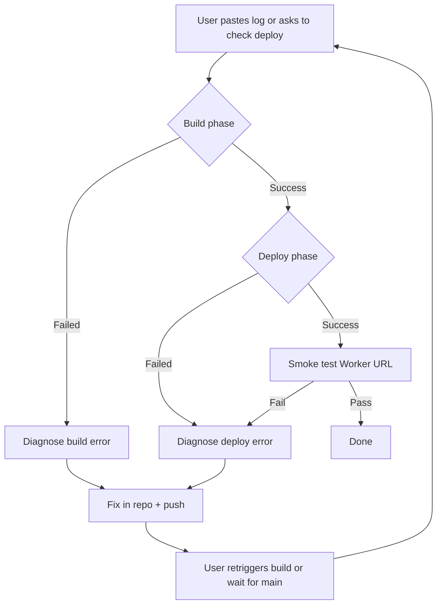

# Cloudflare Deploy Watch & Fix Loop

Use this skill when a **Cloudflare Workers Builds** deploy fails, the user pastes build/deploy logs, or you need to verify production after a merge to `main`.

## Goal

Watch the deployment, read logs, diagnose failures, apply minimal fixes, push, and retry until deploy succeeds — or stop with a clear human handoff when blocked.

## Constants (this project)

| Item | Value |
|------|--------|
| Production Worker | `true-rankings-cfb` |
| Dev Worker (optional) | `cfb-rankings-dev` (`wrangler deploy --env dev`) |
| Build command | `npm run build` |
| Deploy command | `npx wrangler deploy --env=""` |
| Node | 22+ (`.nvmrc`) |
| Static assets | `frontend/build` (includes `_headers` from `frontend/static/_headers`) |
| API | Flask container via `/api/*` |

## Watch loop



### 1. Gather evidence

- **User log paste** — parse timestamps; separate **install**, **build**, **deploy** phases.
- **Dashboard** — Workers & Pages → `true-rankings-cfb` → **Deployments** → latest build log.
- **Runtime logs** (after deploy): `npx wrangler tail true-rankings-cfb` (needs `wrangler login` or API token).
- **MCP** — if `Cloudflare-builds` MCP is authenticated, use it for build status; otherwise rely on logs the user provides.
- **Git** — confirm which commit/branch Cloudflare built (`main` vs PR branch).

### 2. Classify the failure

| Phase | Symptom | Likely cause |
|-------|---------|----------------|
| Install | `vite: not found` | Frontend deps not installed; fix `package.json` `postinstall` + `build` script |
| Install | Node 20 / Wrangler Node error | Bump `.nvmrc` and `engines.node` to 22 |
| Build | Svelte/TS errors | Fix frontend code; run `cd frontend && npm run check` |
| Deploy | `Invalid _headers configuration` | Bad `frontend/static/_headers` format (no C-style `/* */` comment blocks) |
| Deploy | Worker name mismatch warning | Align `wrangler.toml` `name` with dashboard Worker (`true-rankings-cfb`) |
| Deploy | Container / Docker errors | Workers Builds must build Dockerfile; check `Dockerfile` and `[[containers]]` in `wrangler.toml` |
| Runtime | 503 on `/api/*` | Container cold start / provisioning (wait 2–5 min after first deploy) |
| Runtime | 401 on rankings | Missing `CFBD_API_KEY` secret in dashboard |

### 3. `_headers` format (Workers static assets)

File: `frontend/static/_headers` → copied to `frontend/build/_headers`.

**Valid** — path line, then indented `Name: value` lines. `/*` = all paths:

```
/*
  X-Frame-Options: DENY
  X-Content-Type-Options: nosniff

/index.html
  Cache-Control: no-cache
```

**Invalid** — C-style comment blocks with `*` prefixes or `*/` on their own lines break deploy (error code `100324`).

### 4. Fix, commit, push

1. Create branch: `cursor/<short-description>-67e2`
2. Minimal diff only — match existing conventions
3. Verify locally when possible:
   - `npm run build`
   - Inspect `frontend/build/_headers` if headers-related
4. Commit, `git push -u origin <branch>`, open/update PR
5. Ask user to **retry Workers Build** on `main` after merge, or build from PR branch if configured

### 5. Post-deploy smoke test

Replace `<account>` with the Cloudflare account subdomain:

```bash
WORKER_URL="https://true-rankings-cfb.<account>.workers.dev"
curl -sf "${WORKER_URL}/"
curl -sf --max-time 120 "${WORKER_URL}/api/rankings?year=2024&week=10" \
  | python3 -c "import sys,json; d=json.load(sys.stdin); assert len(d.get('team_rankings',[]))>0"
```

If custom domain is configured, test that URL instead.

### 6. When to stop and escalate to a human

Stop the loop and report clearly when:

- Cloudflare account/plan blocker (Containers require Workers Paid; user must upgrade)
- Missing secrets only the user can set (`CFBD_API_KEY`, `CLOUDFLARE_API_TOKEN`)
- Builds API token missing **Containers** edit — bare `Unauthorized` after Docker image build (dashboard-only; see DEPLOY-CLOUDFLARE.md)
- Dashboard-only misconfiguration (wrong production branch, wrong build/deploy commands) — give exact settings table
- Repeated failure after 2–3 fix attempts with no new signal in logs
- MCP/API auth unavailable and user cannot paste logs

Handoff template:

> **Status:** Blocked after N attempts  
> **Last error:** (one line)  
> **What we tried:** (bullets)  
> **What you need to do:** (dashboard steps or secrets)  
> **PR:** (link if open)

## Workers Builds settings checklist

| Setting | Value |
|---------|--------|
| Production branch | `main` |
| Build command | `npm run build` |
| Deploy command | `npx wrangler deploy --env=""` |
| API token | Custom token with Workers Scripts **and** Containers edit |
| Node | 22 |

## Related files

- `wrangler.toml` — Worker name, assets, containers
- `package.json` — root build/postinstall scripts
- `frontend/static/_headers` — security headers for static assets
- `docs/DEPLOY-CLOUDFLARE.md` — full deployment guide
- `.github/workflows/deploy-cloudflare.yml` — optional GitHub Actions deploy
