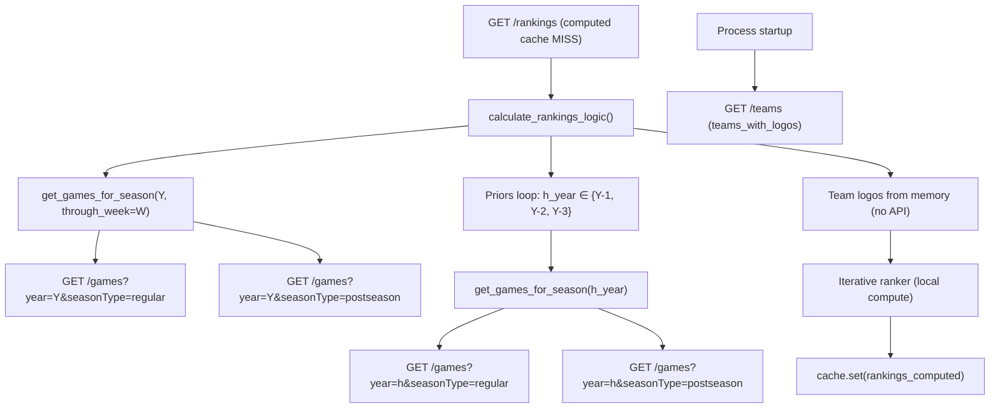

# CFBD API Integration Audit

**Project:** CFB Ranking System  
**Date:** 2026-08-01  
**Scope:** `api_integration.py`, `data_processor.py`, `cache.py`, `app.py`, `requirements.txt`  
**Auditor context:** Traces cache-miss behavior, evaluates MCP alternatives, and prioritizes optimization work.

---

## Executive Summary

The CFB Ranking System talks to College Football Data (CFBD) through a hand-rolled REST client (`CFBDApiClient` in `api_integration.py`) backed by a two-tier cache (memory + file/R2). A cold `GET /rankings` request triggers **~8 CFBD HTTP calls** (games only, with teams already cached at startup) or **~9** on a fully cold process. The dominant cost is not network latency alone but **re-fetching full-season game payloads** for the target year plus three prior seasons, then **recomputing priors from scratch** on every computed-rankings cache miss.

The `cfbd==5.13.2` Python SDK listed in `requirements.txt` is **never imported**; all integration uses `requests` directly against `https://api.collegefootballdata.com` (legacy v1 host). Several client methods (`get_team_info`, `get_rankings`) and a cache constant (`TTL_PRIORS`) are defined but unused. The prefix-index invalidation path in `cache.py` is effectively broken for API-layer caches because keys are never registered.

**Recommendations at a glance:**

| Use case | Approach |
|---|---|
| Batch ranking pipeline (Flask `/rankings`, CLI) | **Keep direct REST** — predictable, cacheable, no MCP overhead |
| Agent / chat queries (exploratory CFBD lookups) | **Adopt MCP** — `lenwood/cfbd-mcp-server` for breadth; optional `gedin-eth/cfb-mcp` for odds |
| CI validation / smoke tests | **Keep REST** — deterministic fixtures, no extra process |

Top optimization wins: week-scoped game fetches, priors result caching, fix `invalidate_prefix` registration, remove unused `cfbd` SDK, and consolidate team metadata fetching.

---

## 1. Current Architecture

### 1.1 Data flow

```
Flask app.py / CLI main.py
        │
        ▼
  CFBDataProcessor (data_processor.py)
        │  init: get_teams_with_logos()
        │  get_games_for_season() → priors loop (3 prior years)
        ▼
  CFBDApiClient (api_integration.py)
        │  _make_request() via requests
        ▼
  Cache (cache.py) — memory + FileCacheBackend / R2CacheBackend
        │
        ▼
  https://api.collegefootballdata.com
```

### 1.2 Entry points and CFBD touchpoints

| Entry point | CFBD usage | Computed cache |
|---|---|---|
| `app.py` → `GET /rankings` | Full pipeline via `calculate_rankings_logic()` | Yes (`rankings_computed`, 30 min TTL) |
| `app.py` → `GET /rankings/team/<name>` | Same pipeline, **no computed cache** | No — recalculates every request |
| `main.py` CLI | Same as above + optional `/lines` when `use_ats=True` | No computed cache in CLI |
| Startup (`CFBDataProcessor.__init__`) | `GET /teams` once | Cached 24 h (`TTL_TEAMS`) |

### 1.3 Endpoints implemented in `CFBDApiClient`

| Method | CFBD path | Used by production path? | Cache TTL |
|---|---|---|---|
| `get_games()` | `GET /games` | **Yes** — primary data source | 1 h current / 7 d historical |
| `get_teams_with_logos()` | `GET /teams` | **Yes** — startup + logo enrichment | 24 h |
| `get_team_info()` | `GET /teams/fbs` | **No** — dead code | 24 h (if ever called) |
| `get_rankings()` | `GET /rankings` | **No** — dead code (poll rankings, not app rankings) | Same as games TTL |
| `get_betting_lines()` | `GET /lines` | CLI only (`use_ats=True`) | Same as games TTL |

---

## 2. CFBD API Call Graph

### 2.1 Call graph on `GET /rankings` cache miss

Assumes: valid `CFBD_API_KEY`, empty `.cache/`, teams fetched once at process startup (always true for `app.py` because `CFBDataProcessor` is instantiated at import).



### 2.2 Endpoint count table

| # | Trigger | Endpoint | Params (typical) | Cached key prefix |
|---|---|---|---|---|
| 0 | Startup | `GET /teams` | (none) | `teams_with_logos` |
| 1 | Current season | `GET /games` | `year=Y, seasonType=regular` | `games` |
| 2 | Current season | `GET /games` | `year=Y, seasonType=postseason` | `games` |
| 3 | Prior Y-1 | `GET /games` | `year=Y-1, seasonType=regular` | `games` |
| 4 | Prior Y-1 | `GET /games` | `year=Y-1, seasonType=postseason` | `games` |
| 5 | Prior Y-2 | `GET /games` | `year=Y-2, seasonType=regular` | `games` |
| 6 | Prior Y-2 | `GET /games` | `year=Y-2, seasonType=postseason` | `games` |
| 7 | Prior Y-3 | `GET /games` | `year=Y-3, seasonType=regular` | `games` |
| 8 | Prior Y-3 | `GET /games` | `year=Y-3, seasonType=postseason` | `games` |

**Total on rankings cache miss: ~8** (games only, teams warm) or **~9** (fully cold process including startup `/teams`).

> **Note:** `week` is accepted by `get_games()` but **never passed** from `get_games_for_season()`. Every call downloads the **entire season** (regular + postseason), then filters client-side via `through_week`. This is the single largest avoidable over-fetch.

### 2.3 Cache-hit behavior

| Layer | Key pattern | TTL | Notes |
|---|---|---|---|
| API games | MD5 of `games:(year, week, season_type):{}` | 1 h / 7 d | Per-season regular + postseason keys |
| API teams | MD5 of `teams_with_logos:():{}` | 24 h | Loaded once per process |
| Computed rankings | MD5 of `rankings_computed:**cache_params` | 30 min | Includes all tuning query params |

After the first cold request for a `(year, week, params…)` tuple, repeat `/rankings` calls are served from computed cache with **zero CFBD calls**.

### 2.4 Secondary paths

| Path | Extra CFBD calls |
|---|---|
| `GET /rankings/team/<name>` | Same ~8 as above **every request** (no computed cache) |
| CLI with `--use-ats` | +1 `GET /lines?year=Y&seasonType=regular[&week=W]` |
| Week change within same season | Still 2 full-season game fetches for current year (no week in API params) |

---

## 3. Cache System Analysis

### 3.1 Layers (`cache.py`)

1. **Memory dict** (`_memory_cache`) — thread-safe via `RLock`; repopulated from backend on hit.
2. **Persistence** — `FileCacheBackend` (default, `.cache/`) or `R2CacheBackend` when `CACHE_BACKEND=r2`.
3. **Prefix index** (`_prefix_index` in `_index.json`) — intended for bulk invalidation via `invalidate_prefix()`.

### 3.2 TTL constants

| Constant | Value | Applied to |
|---|---|---|
| `TTL_TEAMS` | 24 h | `/teams`, `/teams/fbs` |
| `TTL_GAMES_HISTORICAL` | 7 d | Completed seasons |
| `TTL_GAMES_CURRENT` | 1 h | In-progress season |
| `TTL_RANKINGS` | 30 min | Computed rankings + memory rehydration |
| `TTL_PRIORS` | 7 d | **Defined but never used** |

Historical vs current season is determined by `is_historical_season()` (year < now, or same year before August).

### 3.3 Bug: `invalidate_prefix()` with MD5 keys

**Problem:** Keys are opaque MD5 hashes from `_generate_key(prefix, *args, **kwargs)`. The prefix index only populates when `cache.set(..., prefix=prefix)` is called.

**Evidence:**

- `@cached` decorator in `cache.py` correctly passes `prefix=prefix` (line 260).
- `api_integration.py` calls `self._cache.set(cache_key, result, ttl)` **without** `prefix` on all five set paths (lines 75, 93, 122, 144, 169).
- `app.py` calls `cache.set(cache_key, data, TTL_RANKINGS)` **without** `prefix='rankings_computed'` (line 271).

**Impact:**

- `invalidate_prefix('games')` finds no indexed keys → no-op.
- `get_stats()` under-reports file entries (only counts indexed `games` and `rankings_computed` keys).
- Selective cache busting (e.g., after a new week's games) is impossible without `clear_all()`.

**Fix direction:** Pass semantic prefix on every `set()`, e.g. `self._cache.set(cache_key, result, ttl, prefix='games')`.

### 3.4 Memory rehydration TTL mismatch

In `Cache.get()` (lines 191–195), data loaded from the file backend is stored in memory with a hard-coded `TTL_RANKINGS` (30 min) expiry, regardless of the entry's actual TTL (e.g., 7 days for historical games). This causes unnecessary backend re-reads after 30 minutes even when the file cache entry is still valid.

---

## 4. CFBD MCP Server Evaluation

Three community MCP servers were evaluated against this project's needs. None replace the batch ranking pipeline; they excel at **ad-hoc agent queries**.

### 4.1 Comparison matrix

| Criterion | [lenwood/cfbd-mcp-server](https://github.com/lenwood/cfbd-mcp-server) | [gedin-eth/cfb-mcp](https://github.com/gedin-eth/cfb-mcp) | [rjbrown99/cfbd-mcp-server-with-remote](https://github.com/rjbrown99/cfbd-mcp-server-with-remote) |
|---|---|---|---|
| **Primary purpose** | General CFBD API access for Claude Desktop | Live scores, odds, player/team chat agent | lenwood fork + Redis cache + extra tools |
| **Transport** | stdio (local) | HTTP (FastAPI `/mcp/*` + `/api/*`) | stdio (local) |
| **CFBD API host** | `apinext.collegefootballdata.com` (v2) | CFBD + The Odds API | `apinext.collegefootballdata.com` (v2) |
| **Tool count** | 9 tools (games, records, plays, drives, rankings, WP, box score, …) | 5 high-level tools (odds, player stats, team results, …) | 12 tools (+ roster, coaches, lines) |
| **Built-in caching** | None | None | Redis URL-cache (SHA-256 of full URL) |
| **Prompt templates** | Yes (analyze-game, compare-teams, …) | No (agent service in Phase 2) | Inherited from lenwood |
| **Extra deps** | uv, Python 3.11+ | FastAPI, Docker, Odds API key, OpenAI (Phase 2) | Redis optional |
| **Maintenance** | Active (26★, Smithery listed) | Phase 2 in progress; last update Dec 2025 | Fork (0★); 3 contributors |
| **Fit: batch ranking** | Poor — no batch/cache integration | Poor — opinionated REST wrappers | Poor — same as lenwood |
| **Fit: agent chat** | **Excellent** — broad CFBD surface | **Good** — live odds/scores focus | Good — adds lines/roster/coaches + Redis |
| **Fit: CI validation** | Poor — requires MCP host | Poor — multi-service stack | Poor — Redis dependency |

### 4.2 lenwood/cfbd-mcp-server

**Strengths:**

- Mature, documented, Smithery-installable.
- Typed schemas (`cfbd_schema.py`) with validation.
- Covers the endpoints most useful for conversational analysis: games, play-by-play, drives, poll rankings, win probability.
- Uses CFBD API **v2** (`apinext`), which may expose fields absent from v1.

**Weaknesses:**

- stdio-only — not suitable for remote Cloud Agent without a wrapper.
- No response caching — every tool call hits CFBD (rate-limit risk in chat loops).
- Returns raw JSON strings — no transformation to this app's internal game schema.
- API host differs from production app (`apinext` vs `api`), so field names/shapes may diverge.

**Verdict:** Best default MCP for adding CFBD-aware chat to Cursor/Claude without modifying the ranking pipeline.

### 4.3 gedin-eth/cfb-mcp

**Strengths:**

- HTTP-first — deployable as a sidecar (`uvicorn src.server:app`).
- Dual REST + MCP endpoints simplify testing and non-MCP clients.
- High-level tools (`get_game_odds_and_score`, `get_recent_player_stats`) map well to fan-facing chat queries.
- Docker Compose + Caddy path for production agent UI.

**Weaknesses:**

- Requires **The Odds API** key in addition to CFBD — extra cost and failure surface.
- Only 5 tools; no play-by-play, drives, or advanced metrics.
- Phase 2 agent/web UI still in progress; maintenance signal is weaker than lenwood.
- Not designed for bulk season ingestion.

**Verdict:** Adopt selectively if the product roadmap includes live odds/scores chat. Not a replacement for ranking data ingestion.

### 4.4 rjbrown99/cfbd-mcp-server-with-remote

**Strengths:**

- Adds Redis URL-keyed caching (similar concept to this app's cache, but keyed on full URL hash).
- Extra tools: `get-lines`, `get-coaches`, `get-roster`.
- Debug logging levels for CFBD request/response tracing.

**Weaknesses:**

- Despite the name, still uses **stdio transport** — "remote" refers to Redis-backed cache, not remote MCP over HTTP.
- Low fork activity (0 stars, small contributor set).
- Redis is optional but adds operational complexity.
- Inherits lenwood's lack of batch/ranking integration.

**Verdict:** Consider if Redis-cached MCP tooling is needed alongside lenwood; otherwise prefer upstream lenwood for maintenance.

### 4.5 API version note

| Component | Base URL |
|---|---|
| This app (`api_integration.py`) | `https://api.collegefootballdata.com` |
| All three MCP servers | `https://apinext.collegefootballdata.com/` |

Field names in `_transform_game()` (`homeTeam`, `homePoints`, …) match v1 conventions. A future migration to v2 (or the official `cfbd` SDK) should be a deliberate, tested change — not a side effect of MCP adoption.

---

## 5. Recommendation Matrix

| Scenario | Recommendation | Rationale |
|---|---|---|
| **Batch ranking** (Flask `/rankings`, CLI `main.py`) | **Keep REST** | Deterministic pipeline, file cache, no MCP process overhead, tunable TTLs, works in CI without MCP host |
| **Agent chat** (Cursor Cloud Agent, exploratory queries) | **Adopt MCP** | Natural-language tool selection, schema resources, prompt templates; use **lenwood** as primary, **gedin-eth** if odds needed |
| **CI validation** (smoke tests, regression checks) | **Keep REST** | Mock/stub `CFBDApiClient` or use cached fixtures; MCP adds flakiness and extra services |
| **Team breakdown endpoint** | **Keep REST**, fix caching | Reuse computed rankings cache before considering MCP |
| **ATS / betting features** | **Keep REST** (`/lines`) | Already implemented; MCP `get-lines` adds no value for batch path |

### Integration pattern for MCP (when adopted)

```
┌─────────────────────┐     ┌──────────────────────┐
│  Ranking Pipeline   │     │   Agent / Chat Layer │
│  (REST, cached)     │     │   (MCP tools)        │
│  app.py / main.py   │     │   lenwood/cfbd-mcp   │
└─────────┬───────────┘     └──────────┬───────────┘
          │                            │
          └──────────┬─────────────────┘
                     ▼
            CFBD API (shared API key)
```

Do **not** route `/rankings` through MCP. Configure MCP only in agent/IDE settings for interactive queries.

---

## 6. Optimization Targets

### 6.1 Week-scoped fetches (high impact)

**Current:** `get_games_for_season()` always calls `get_games(year=year)` with no `week`, downloading all regular-season games, then filters in Python.

```78:87:data_processor.py
        raw_games = self.api_client.get_games(year=year)
        
        # Also fetch postseason games to ensure complete data for priors
        postseason_games = self.api_client.get_games(year=year, season_type='postseason')
        if postseason_games:
            raw_games.extend(postseason_games)
        
        # Filter by week if requested
        if through_week:
            raw_games = [g for g in raw_games if g['week'] <= through_week]
```

**Target:** When `through_week` is set, fetch weeks `1..through_week` individually (or use CFBD week param if a single cumulative fetch is insufficient). For prior seasons used in priors, always fetch full season (unchanged).

**Expected savings:** Current-year payload reduced by ~(15 - W) / 15 for week W requests; latency and memory drop proportionally.

### 6.2 Priors cache (high impact)

**Current:** On every computed-rankings cache miss, `calculate_rankings_logic()` re-fetches three prior seasons and re-runs `TeamQualityRanker` over all historical games to rebuild priors.

```99:117:app.py
    for h_year in range(year - 1, year - 4, -1):
        try:
            h_games = data_processor.get_games_for_season(h_year)
            ...
            history_data.append(h_results)
        except Exception as e:
            ...
    priors = TeamQualityRanker.calculate_priors(history_data)
```

**Target:** Cache priors keyed by `(year - 1, year - 2, year - 3, config_hash)` with `TTL_PRIORS` (7 d). Historical game data rarely changes; priors computation is pure CPU.

**Expected savings:** Eliminates 6 game API calls + significant CPU on warm priors cache.

### 6.3 `invalidate_prefix` bug (medium impact — operability)

**Current:** API cache entries use MD5 keys without prefix registration → bulk invalidation broken.

**Target:** Register prefixes on all `cache.set()` calls; optionally expose `POST /cache/invalidate?prefix=games&year=2024`.

### 6.4 Unused `cfbd` SDK (low impact — hygiene)

**Current:** `requirements.txt` pins `cfbd==5.13.2`; zero imports in the codebase.

**Target:** Either remove the dependency or migrate `CFBDApiClient` to the official SDK for typed models and v2 support. Removal is lowest risk today.

### 6.5 Uncached / oversized team endpoint (medium impact)

**Current:** `get_teams_with_logos()` hits `GET /teams` (all classifications). `get_team_info()` hits `GET /teams/fbs` but is **never called**.

**Target options (pick one):

1. Switch to `/teams/fbs` if logos exist for FBS schools (verify API response).
2. Keep `/teams` but document why (FCS opponents need conference data).
3. Lazy-load logos only for teams appearing in rankings output.

Also: `/rankings/team/<name>` bypasses computed cache — should read from or write to the same `rankings_computed` key.

### 6.6 Dead API client methods (low impact — hygiene)

| Method | Endpoint | Action |
|---|---|---|
| `get_team_info()` | `/teams/fbs` | Remove or merge with `get_teams_with_logos()` |
| `get_rankings()` | `/rankings` | Remove or use for future "compare to AP poll" feature |

### 6.7 Memory cache TTL mismatch (low–medium impact)

**Current:** `Cache.get()` assigns `TTL_RANKINGS` (30 min) to all entries rehydrated from disk.

**Target:** Persist and respect the original TTL when promoting to memory.

---

## 7. Prioritized Action Items

| Priority | Item | Files | Effort | Impact |
|---|---|---|---|---|
| **P0** | Pass `week` to `get_games()` when `through_week` is set for current season | `data_processor.py`, `api_integration.py` | S | High — smaller payloads, faster cold requests |
| **P0** | Cache computed priors with `TTL_PRIORS` | `app.py`, `cache.py`, optionally `main.py` | M | High — skip 6 API calls + CPU on warm priors |
| **P1** | Fix `invalidate_prefix` by passing `prefix` on all `cache.set()` | `api_integration.py`, `app.py` | S | Medium — enables surgical cache bust |
| **P1** | Share computed rankings cache with `/rankings/team/<name>` | `app.py` | S | Medium — avoids duplicate ~8-call pipeline |
| **P1** | Remove or adopt `cfbd==5.13.2` | `requirements.txt`, optionally `api_integration.py` | S | Low — dependency hygiene |
| **P2** | Evaluate `/teams/fbs` vs `/teams` for logo/conference needs | `api_integration.py`, `data_processor.py` | S | Medium — smaller team payload |
| **P2** | Fix memory rehydration TTL to respect stored expiry | `cache.py` | S | Low–Medium — fewer disk reads |
| **P2** | Remove dead methods `get_team_info()`, `get_rankings()` or wire to features | `api_integration.py` | S | Low — clarity |
| **P3** | Configure `lenwood/cfbd-mcp-server` in Cursor MCP for agent chat | IDE config (not repo code) | S | Enables conversational CFBD queries |
| **P3** | Plan CFBD API v2 migration (`apinext` or SDK) | `api_integration.py` | L | Future-proofing; test `_transform_game` field map |
| **P3** | Add CI smoke test stubbing `CFBDApiClient` with fixture JSON | new `tests/`, `api_integration.py` | M | Validates pipeline without live API |

### Suggested implementation order

1. **Week-scoped fetches** — immediate latency win, no schema changes.
2. **Priors cache** — biggest reduction in repeated cold-path work.
3. **Prefix registration fix** — unblocks operational cache management.
4. **Team endpoint consolidation** — after verifying FBS logo coverage.
5. **MCP adoption** — parallel track for agent UX, not ranking core.

---

## 8. Appendix

### 8.1 Code references — API client base URL

```12:12:api_integration.py
    BASE_URL = "https://api.collegefootballdata.com"
```

### 8.2 Code references — cache set without prefix

```72:75:api_integration.py
        if result:
            ttl = get_games_ttl(year)
            self._cache.set(cache_key, result, ttl)
```

### 8.3 Code references — unused TTL

```21:21:cache.py
TTL_PRIORS = 7 * 24 * 60 * 60
```

### 8.4 Code references — unused SDK in requirements

```
cfbd==5.13.2   # requirements.txt line 5 — no imports in codebase
```

### 8.5 Estimated cold-path timeline (2024 week 10, no cache)

| Phase | CFBD calls | Approx. work |
|---|---|---|
| Startup teams | 1 | ~200 ms |
| Current season games | 2 | ~1–3 s |
| Prior 3 seasons | 6 | ~3–9 s |
| Priors computation | 0 | ~2–5 s CPU |
| Iterative ranking (2×) | 0 | ~1–3 s CPU |
| **Total** | **~8–9** | **~8–20 s** |

Repeat requests within 30 min: **0 CFBD calls** (computed cache hit).

---

*End of audit.*
