# CFB Ranking System — Ops/DevOps Audit & Cloudflare Migration Runbook

**Document ID:** `2026-08-01-ops-cloudflare-runbook`  
**Product:** CFB Ranking System  
**Status:** Audit + migration plan (Render → Cloudflare)  
**Last updated:** 2026-08-01

---

## Executive summary

The CFB Ranking System is deployed today on **Render** (Python API + static SvelteKit frontend) with **GitHub Actions** CI and a **partial Cloudflare path** already wired (`deploy-cloudflare.yml`). There is **no Docker** in the repository; Render runs Python natively via `gunicorn`, and the frontend is built as static assets.

This runbook documents the current ops map, security and observability gaps, a phased Cloudflare migration (Pages → Containers → decommission Render), a GitHub secrets checklist, and a step-by-step production cutover procedure.

---

## 1. Current ops map

### 1.1 Architecture overview

```mermaid
flowchart TB
  subgraph dev["Local development"]
    FE_DEV["SvelteKit dev :5173"]
    API_DEV["Flask app.py :5001"]
    FE_DEV -->|http://localhost:5001| API_DEV
  end

  subgraph gh["GitHub"]
    PR["Push / PR"]
    CI["ci-cd.yml"]
    CF_DEPLOY["deploy-cloudflare.yml"]
    CODEQL["codeql.yml"]
    PR --> CI
    CI -->|main success| CF_DEPLOY
    PR --> CODEQL
  end

  subgraph render["Render (production today)"]
    R_API["cfb-rankings-api<br/>Python + gunicorn<br/>Oregon, free tier"]
    R_FE["cfb-rankings-frontend<br/>Static site<br/>Oregon, free tier"]
    R_FE -->|VITE_API_URL from service host| R_API
  end

  subgraph cf["Cloudflare (partial / planned)"]
    CF_PAGES["Pages: cfb-rankings"]
    CF_CONT["Containers API<br/>gated by ENABLE_CLOUDFLARE_CONTAINERS"]
    R2["R2 cache (optional)"]
    CF_PAGES -->|VITE_API_URL secret| R_API
    CF_CONT --> R2
  end

  subgraph external["External"]
    CFBD["api.collegefootballdata.com"]
  end

  CI -->|autoDeploy via Render GitHub integration| render
  CF_DEPLOY --> CF_PAGES
  CF_DEPLOY -.->|when enabled| CF_CONT
  R_API --> CFBD
  CF_CONT --> CFBD
```



### 1.2 Render (`render.yaml`)

| Service | Name | Runtime | Region | Plan | Build | Start / publish |
|---------|------|---------|--------|------|-------|-----------------|
| API | `cfb-rankings-api` | Python 3.11 | Oregon | Free | `pip install -r requirements.txt` | `gunicorn app:app --bind 0.0.0.0:$PORT` |
| Frontend | `cfb-rankings-frontend` | Static | Oregon | Free | `cd frontend && npm install && npm run build` | `frontend/build` |

**Render environment variables**

| Service | Key | Source |
|---------|-----|--------|
| API | `PYTHON_VERSION` | `3.11` |
| API | `CFBD_API_KEY` | Manual (sync: false) |
| API | `FLASK_ENV` | `production` |
| Frontend | `NODE_VERSION` | `20` |
| Frontend | `VITE_API_URL` | `fromService` → `cfb-rankings-api` host |

**Render frontend hardening (present):**

- `X-Frame-Options: DENY`
- `X-Content-Type-Options: nosniff`
- SPA rewrite: `/* → /index.html`

**Render API health check:** `GET /` (returns JSON service descriptor).

**Auto-deploy:** Both services have `autoDeploy: true` — pushes to the connected branch trigger Render builds independently of CI gate enforcement (CI only gates via GitHub status checks if configured in Render dashboard).

### 1.3 GitHub Actions CI/CD (`.github/workflows/ci-cd.yml`)

Triggered on every **push** and **pull_request**.

| Job | Purpose | Blocking? |
|-----|---------|-----------|
| `scan-python` | flake8 (syntax errors blocking), Bandit, pip-audit | Partial (E9/F63/F7/F82 only) |
| `scan-frontend` | svelte-check (blocking), ESLint (continue-on-error), npm audit high | Partial |
| `test-python` | pytest + coverage | Runs; **no tests collected yet** |
| `build-frontend` | `npm ci && npm run build` | Yes (via pipeline-success) |
| `validate-backend` | Import Flask app, gunicorn config check | Yes (via pipeline-success) |
| `pipeline-success` | Aggregates build-frontend + validate-backend | Required status check candidate |

**Deployment trigger model:**

- Render: native GitHub integration + `autoDeploy: true` in blueprint.
- Cloudflare: `deploy-cloudflare.yml` runs on `workflow_run` after CI succeeds on `main`.

**Additional workflows:**

| Workflow | Trigger | Role |
|----------|---------|------|
| `deploy-cloudflare.yml` | CI success on `main` | Validate Pages build (deploy via Cloudflare Git integration) |
| `codeql.yml` | push/PR to main, weekly cron | SAST for Python + JS/TS |
| `precompute-rankings.yml` | schedule / manual | Generate static rankings JSON for archived weeks |
| ~~Agentic `.md` workflows~~ | — | **Removed from repo** (gh-aw/OpenCode not in use) |

### 1.4 Application runtime (`app.py`)

| Component | Detail |
|-----------|--------|
| Framework | Flask + flask-cors |
| WSGI (prod) | gunicorn (Render); dev uses Flask built-in on `PORT` default 5001 |
| Data source | CFBD API via `CFBDataProcessor` (key required at runtime) |
| Cache | File + in-memory (`cache.py`); optional R2 backend via `CACHE_BACKEND=r2` |

**API routes**

| Method | Path | Description |
|--------|------|-------------|
| GET | `/` | Health / service metadata |
| GET | `/rankings` | Computed rankings (cached, expensive on miss) |
| GET | `/rankings/team/<team_name>` | Team breakdown (uncached full recompute) |
| GET | `/cache/stats` | Cache statistics (public) |
| POST | `/cache/clear` | Clear cache (optional `CACHE_CLEAR_SECRET`) |

**Frontend API wiring** (`frontend/src/lib/api.ts`):

- Dev: `http://localhost:5001`
- Prod: `VITE_API_URL` at build time, fallback `https://cfb-rankings-api.onrender.com`

### 1.5 No Docker

- No `Dockerfile`, `docker-compose.yml`, or container image build in CI.
- Render uses native Python runtime; Cloudflare Containers path in `deploy-cloudflare.yml` calls `wrangler deploy` but **`wrangler.toml` is not yet in the repo** — Phase B is scaffolded, not complete.
- Local dev uses repo-local `venv/` per `AGENTS.md`.

### 1.6 Operational characteristics

| Behavior | Detail |
|----------|--------|
| Cold `/rankings` | Slow: fetches current season + 3 prior seasons, iterative solver |
| Warm `/rankings` | Fast: file/memory cache (TTL 30 min for computed rankings) |
| Cache location | `.cache/` on disk (Render ephemeral filesystem) |
| CFBD dependency | Missing/invalid `CFBD_API_KEY` → empty data → `404` on `/rankings` |
| Free-tier limits | Render free tier spin-down, cold starts, ephemeral disk |

---

## 2. Cloudflare migration plan

### Phase A — Frontend on Cloudflare Pages

**Goal:** Serve the SvelteKit static build from Cloudflare Pages; API remains on Render initially.

**Current state:** `deploy-cloudflare.yml` already deploys `frontend/build` to project `cfb-rankings` after CI passes on `main`.

**Prerequisites**

| Item | Action |
|------|--------|
| Cloudflare account | Create / use existing account |
| Pages project | `cfb-rankings` (created on first deploy or manually) |
| GitHub secrets | `CLOUDFLARE_API_TOKEN`, `CLOUDFLARE_ACCOUNT_ID` |
| API URL at build time | `VITE_API_URL` → Render API URL during Phase A |
| Custom domain (optional) | e.g. `rankings.example.com` on Pages |

**Pages configuration**

```text
Build command:  cd frontend && npm ci && npm run build
Output dir:     frontend/build
Node version:   20
Framework:      SvelteKit (adapter-static, SPA fallback index.html)
```

**Pages security headers** (match or exceed Render — configure in Cloudflare dashboard or `_headers` file):

```text
/*
  X-Frame-Options: DENY
  X-Content-Type-Options: nosniff
  Referrer-Policy: strict-origin-when-cross-origin
  Permissions-Policy: camera=(), microphone=(), geolocation=()
```

**Phase A validation checklist**

- [ ] Pages URL loads SPA routes (client-side routing)
- [ ] Rankings fetch succeeds against Render API
- [ ] `npm run check` passes in CI
- [ ] Smoke test in `deploy-cloudflare.yml` passes against Render API

**Phase A DNS (optional custom domain)**

1. Add custom domain in Pages project.
2. Create CNAME to `<project>.pages.dev`.
3. Keep API on Render; no API DNS change yet.

---

### Phase B — Backend on Cloudflare Containers

**Goal:** Run Flask/gunicorn in Cloudflare Containers with durable R2-backed cache.

**Current state:** Job exists in `deploy-cloudflare.yml` but is gated:

```yaml
if: vars.ENABLE_CLOUDFLARE_CONTAINERS == 'true'
```

Missing repo artifacts for a complete deploy:

- `wrangler.toml` (or `wrangler.jsonc`) with Container service definition
- Container image build (Dockerfile required for Containers even though Render does not use one today)
- R2 bucket + credentials wired as secrets

**Recommended Phase B deliverables**

1. **Dockerfile** (minimal production image):

   ```dockerfile
   FROM python:3.11-slim
   WORKDIR /app
   COPY requirements.txt .
   RUN pip install --no-cache-dir -r requirements.txt
   COPY . .
   ENV PORT=8080
   CMD ["gunicorn", "app:app", "--bind", "0.0.0.0:8080", "--workers", "2", "--timeout", "120"]
   ```

2. **`wrangler.toml`** skeleton:

   ```toml
   name = "cfb-rankings-api"
   main = "."
   compatibility_date = "2026-01-01"

   [vars]
   FLASK_ENV = "production"
   CACHE_BACKEND = "r2"

   # Container + R2 bindings configured per Cloudflare Containers docs
   ```

3. **Environment variables (Container runtime)**

   | Variable | Required | Notes |
   |----------|----------|-------|
   | `CFBD_API_KEY` | Yes | From GitHub secret / CF secret store |
   | `CACHE_CLEAR_SECRET` | Yes (prod) | Protect `/cache/clear` |
   | `CACHE_BACKEND` | Yes | `r2` for durable cache across restarts |
   | `R2_BUCKET_NAME` | Yes (if r2) | Rankings cache bucket |
   | `R2_ACCESS_KEY_ID` | Yes (if r2) | R2 API token |
   | `R2_SECRET_ACCESS_KEY` | Yes (if r2) | R2 API token |
   | `R2_ENDPOINT_URL` | Yes (if r2) | Account R2 endpoint |
   | `CACHE_DIR` | Optional | `/tmp/cfb-cache` local fallback |

4. **Code changes before cutover**

   - Restrict CORS to Pages origin(s) (see §3.1).
   - Set `CACHE_CLEAR_SECRET` in all production environments.
   - Add rate limiting at Cloudflare edge (see §3.4) or in-app.

5. **Enable deploy**

   - Set repository variable `ENABLE_CLOUDFLARE_CONTAINERS=true`.
   - Update `VITE_API_URL` and `API_URL` secrets to Container public URL.
   - Re-run deploy workflow.

**Phase B validation checklist**

- [ ] `GET /` returns health JSON from Container URL
- [ ] `GET /rankings?year=2024&week=10` completes within timeout (≤120s cold)
- [ ] Second request is faster (R2 + memory cache hit)
- [ ] `POST /cache/clear` returns 401 without secret, 200 with `X-Cache-Secret`
- [ ] CFBD egress works from Container runtime
- [ ] Pages frontend pointed at Container API loads rankings

---

### Phase C — Decommission Render

**Goal:** Remove Render services and make Cloudflare the sole production host.

**Preconditions (all must be true)**

- [ ] Cloudflare Pages serving 100% frontend traffic (DNS cutover complete)
- [ ] Cloudflare Containers API stable for ≥7 days
- [ ] R2 cache populated; cold-start latency acceptable
- [ ] Monitoring/alerting in place (see §5)
- [ ] Rollback plan documented and tested

**Decommission steps**

1. Disable Render auto-deploy on both services (dashboard or remove GitHub integration).
2. Confirm no traffic to `*.onrender.com` URLs (Cloudflare analytics / access logs).
3. Export any logs or metrics needed from Render.
4. Delete `cfb-rankings-frontend` static service.
5. Delete `cfb-rankings-api` web service.
6. Remove Render-specific fallbacks in code/docs:
   - `frontend/src/lib/api.ts` default API URL
   - `deploy-cloudflare.yml` Render fallback URLs in smoke tests
7. Archive or delete `render.yaml` (optional — keep for reference until confirmed stable).
8. Update README and `AGENTS.md` with Cloudflare-only ops instructions.

**Post-decommission**

- Rotate `CFBD_API_KEY` if it was ever exposed in Render logs.
- Review Cloudflare billing (Containers + R2 + Pages).

---

## 3. Security gaps

### 3.1 CORS — open wildcard with credentials

**Location:** `app.py`

```python
CORS(app, origins=["*"], supports_credentials=True)
```

| Risk | Severity | Detail |
|------|----------|--------|
| Misconfigured CORS + credentials | **High** | Browsers reject `*` with credentials in spec; library behavior may vary. Any origin can call the API from browser contexts without credentials protection. |
| CSRF-like abuse | **Medium** | Public read API; write surface limited to `/cache/clear`. |

**Remediation**

```python
ALLOWED_ORIGINS = os.environ.get(
    "CORS_ORIGINS",
    "http://localhost:5173,https://cfb-rankings.pages.dev"
).split(",")

CORS(app, origins=[o.strip() for o in ALLOWED_ORIGINS], supports_credentials=False)
```

Set `CORS_ORIGINS` per environment:

| Environment | Value |
|-------------|-------|
| Local | `http://localhost:5173` |
| Phase A Pages | Pages preview + production URLs |
| Phase B+ | Production custom domain only |

### 3.2 `/cache/clear` — optional secret

**Location:** `app.py` — if `CACHE_CLEAR_SECRET` is unset, endpoint is **unauthenticated**.

| Risk | Severity | Detail |
|------|----------|--------|
| Cache purge DoS | **High** | Attacker forces expensive recomputation on every rankings request. |
| Operational abuse | **Medium** | Anyone can wipe cache during peak traffic. |

**Remediation**

1. **Require** `CACHE_CLEAR_SECRET` in production; fail closed:

   ```python
   if not expected_secret:
       return jsonify({"error": "Cache clear disabled"}), 503
   ```

2. Set secret in Render, Cloudflare Container secrets, and GitHub (for ops scripts only — not frontend).
3. Restrict to internal networks or Cloudflare Access if ops-only.
4. Log cache clear events with timestamp and source IP.

### 3.3 `/cache/stats` — public information disclosure

| Risk | Severity | Detail |
|------|----------|--------|
| Reconnaissance | **Low** | Exposes cache backend, entry counts, directory paths. |

**Remediation:** Require same secret as clear, or remove from public API and expose via internal metrics only.

### 3.4 Rate limiting — missing on expensive endpoints

| Endpoint | Cost | Current protection |
|----------|------|-------------------|
| `GET /rankings` | High (CFBD + compute) | Cache only |
| `GET /rankings/team/*` | Very high (full recompute, no cache in handler) | None |
| `GET /cache/stats` | Low | None |
| `POST /cache/clear` | Medium | Optional secret |

**Remediation (Cloudflare edge — preferred)**

Configure WAF rate limiting rules on the API hostname:

| Rule | Threshold | Action |
|------|-----------|--------|
| `/rankings*` | 30 req/min/IP | Block or challenge |
| `/cache/clear` | 5 req/hour/IP | Block |
| Global API | 100 req/min/IP | Log + block |

**Remediation (application — defense in depth)**

- Add Flask-Limiter or similar for `/rankings` and team breakdown.
- Cache team breakdown responses (currently uncached).

### 3.5 Security headers — API missing

Render frontend sets `X-Frame-Options` and `X-Content-Type-Options`. The **API returns JSON with no security headers**.

**Remediation (Cloudflare Transform Rules or Flask middleware)**

```text
Strict-Transport-Security: max-age=31536000; includeSubDomains
X-Content-Type-Options: nosniff
X-Frame-Options: DENY
Cache-Control: no-store (for /cache/* and error responses)
```

### 3.6 Secrets and supply chain

| Gap | Severity | Notes |
|-----|----------|-------|
| `CFBD_API_KEY` in CI logs | Medium | Ensure secrets masking in Actions |
| No automated tests | Medium | Regressions reach production via CI build-only gate |
| Bandit/npm audit | Low–Medium | Bandit `|| true` on JSON step; ESLint non-blocking |
| Error responses leak internals | Low | `500` responses include exception string |

**Remediation:** Sanitize production error messages; enforce `pipeline-success` as required check on `main`; add smoke/integration tests for `/rankings`.

### 3.7 Security monitoring

Weekly agentic workflow (`.github/workflows/security-audit.md`) checks CORS, cache clear, rate limits, and dependency audits. Ensure workflow is compiled and scheduled.

---

## 4. Observability gaps

### 4.1 Current state

| Area | Implementation | Gap |
|------|----------------|-----|
| Logging | `print()` to stdout | No structure, levels, or correlation IDs |
| Metrics | None | No request latency, cache hit rate, CFBD call counts |
| Tracing | None | Cannot trace slow `/rankings` across CFBD fetches |
| Health checks | `GET /` only | No deep health (CFBD reachable, cache writable) |
| Alerting | None | No PagerDuty/Slack/email on 5xx or deploy failure |
| Dashboards | None | No unified view of traffic, errors, cache |
| Deploy verification | Basic curl smoke test | No frontend E2E, no cache-hit assertion |
| Log retention | Render/CF platform default | No centralized log aggregation |
| Uptime monitoring | None documented | External ping not configured |

### 4.2 Recommended observability stack (Cloudflare-aligned)

| Layer | Tool | Purpose |
|-------|------|---------|
| Edge | Cloudflare Analytics + Security Events | Traffic, WAF, rate limit triggers |
| Workers/Pages | Cloudflare Logpush → R2 or SIEM | Long-term HTTP logs |
| Containers | Platform logs + Logpush | API request/error logs |
| Synthetic | Cloudflare Health Checks or GitHub scheduled workflow | Uptime on `/` and `/rankings?year=2024&week=10` |
| Errors | Sentry (optional, Flask SDK) | Exception tracking with release tags |
| Metrics | Prometheus-compatible endpoint or Cloudflare observability | Cache hit ratio, p95 latency |

### 4.3 Minimum viable observability (pre–Phase C)

1. **Structured JSON logging** in `app.py` (request_id, path, duration_ms, cache_hit, status).
2. **`GET /health`** deep check: CFBD ping + cache write/read probe (do not expose secrets).
3. **GitHub Actions smoke test** enhancements:
   - Assert JSON keys in rankings response
   - Record response time artifact
   - Fail deploy on >120s rankings timeout
4. **External uptime monitor** (free tier acceptable) on Pages URL and API `/`.
5. **Alert** on consecutive CI/deploy failures on `main`.

### 4.4 Key metrics to track

| Metric | Target | Alert threshold |
|--------|--------|-----------------|
| `/rankings` p95 latency (cached) | < 2s | > 10s |
| `/rankings` p95 latency (uncached) | < 90s | > 120s |
| Cache hit rate | > 80% during season | < 50% for 1h |
| 5xx error rate | < 0.1% | > 1% for 15m |
| CFBD API errors | 0 sustained | > 5 in 5m |
| Deploy smoke test | 100% pass | Any failure |

---

## 5. GitHub secrets & variables checklist

### 5.1 Repository secrets (Settings → Secrets and variables → Actions)

| Secret | Required for | Phase | Notes |
|--------|--------------|-------|-------|
| `CFBD_API_KEY` | CI validate-backend, pytest, Container deploy | All | From collegefootballdata.com; rotate annually |
| `CLOUDFLARE_API_TOKEN` | Pages + Containers deploy | A+ | Scoped: Account → Cloudflare Pages Edit, Workers Containers Edit |
| `CLOUDFLARE_ACCOUNT_ID` | wrangler-action | A+ | Cloudflare dashboard → Account ID |
| `VITE_API_URL` | Frontend build in deploy-cloudflare | A+ | Full API base URL, no trailing slash |
| `API_URL` | Post-deploy smoke tests | A+ | Same as production API URL |
| `CACHE_CLEAR_SECRET` | Production cache ops (not in frontend build) | B+ | Random 32+ char string |
| `R2_ACCESS_KEY_ID` | R2 cache backend | B+ | If not injected solely via wrangler bindings |
| `R2_SECRET_ACCESS_KEY` | R2 cache backend | B+ | Store only in CF secrets / GH secrets |
| `MINIMAX_API_KEY` | Agentic workflows (opencode engine) | Optional | For gh-aw scheduled agents |

### 5.2 Repository variables (Settings → Secrets and variables → Actions → Variables)

| Variable | Value | Purpose |
|----------|-------|---------|
| `ENABLE_CLOUDFLARE_CONTAINERS` | `false` → `true` | Gate Phase B Container deploy job |

### 5.3 Cloudflare dashboard secrets (Container / Workers)

| Secret | Purpose |
|--------|---------|
| `CFBD_API_KEY` | Runtime CFBD client |
| `CACHE_CLEAR_SECRET` | Protect cache admin endpoints |
| R2 binding credentials | Via wrangler binding (preferred over plain env) |

### 5.4 Cloudflare API token permissions (minimum)

| Permission | Scope |
|------------|-------|
| Cloudflare Pages | Edit |
| Account Settings | Read |
| Workers Scripts | Edit (Containers) |
| Workers R2 Storage | Edit (if using R2) |

### 5.5 Pre-flight secrets verification script

Run locally or in a manual workflow dispatch:

```bash
# GitHub CLI — list secret names (values not shown)
gh secret list

# Verify Cloudflare token (replace IDs)
curl -s -H "Authorization: Bearer $CLOUDFLARE_API_TOKEN" \
  "https://api.cloudflare.com/client/v4/accounts/$CLOUDFLARE_ACCOUNT_ID/tokens/verify" | jq .success

# Verify CFBD key
curl -s -H "Authorization: Bearer $CFBD_API_KEY" \
  "https://api.collegefootballdata.com/teams/fbs" | head -c 200
```

### 5.6 Secrets rotation schedule

| Secret | Rotation frequency | Procedure |
|--------|-------------------|-----------|
| `CFBD_API_KEY` | Yearly or on leak | Regenerate at CFBD; update GH + CF; redeploy API |
| `CLOUDFLARE_API_TOKEN` | Yearly | Create new token; update GH; revoke old |
| `CACHE_CLEAR_SECRET` | On personnel change | Update GH + CF; no frontend impact |
| R2 keys | Yearly | Rotate in R2 dashboard; update bindings |

---

## 6. Step-by-step cutover runbook

### 6.1 Roles

| Role | Responsibility |
|------|----------------|
| **Ops lead** | DNS, Cloudflare config, go/no-go |
| **Dev lead** | Code changes, CORS, secrets in app |
| **Observer** | Monitors metrics/logs during cutover |

### 6.2 Timeline overview

| Window | Phase | Traffic |
|--------|-------|---------|
| T-7d | Prep | 100% Render |
| T-1d | Phase A dry run | Pages preview URL |
| T0 | Phase A DNS cutover (frontend) | Frontend → Pages; API → Render |
| T+7d | Phase B API cutover | Frontend → Pages; API → Containers |
| T+14d | Phase C Render decommission | 100% Cloudflare |

---

### 6.3 Phase A cutover — Frontend to Cloudflare Pages

**T-7 days: Preparation**

1. Confirm GitHub secrets: `CLOUDFLARE_API_TOKEN`, `CLOUDFLARE_ACCOUNT_ID`, `VITE_API_URL=https://cfb-rankings-api.onrender.com`.
2. Merge any pending frontend changes to `main`; verify CI green.
3. Confirm `deploy-cloudflare.yml` deploy job succeeds; note Pages URL (`https://cfb-rankings.pages.dev` or assigned).
4. Manually test Pages preview:
   - Load home page
   - Select year/week; confirm rankings render
   - Check browser network tab: API calls go to Render URL
5. Add `_headers` or dashboard security headers on Pages (§2 Phase A).

**T-1 day: Dry run**

1. Deploy latest `main` to Pages.
2. Run smoke tests manually:

   ```bash
   PAGES_URL="https://cfb-rankings.pages.dev"
   API_URL="https://cfb-rankings-api.onrender.com"

   curl -sf "${API_URL}/"
   curl -sf --max-time 120 "${API_URL}/rankings?year=2024&week=10" | jq '.team_rankings | length'
   curl -sfI "${PAGES_URL}/" | grep -i x-frame
   ```

3. Document rollback: revert DNS to Render frontend URL.

**T0: DNS cutover (frontend)**

1. **Go/no-go** meeting: CI green, smoke tests pass, no active incidents.
2. Lower DNS TTL to 300s (if custom domain).
3. Point custom domain CNAME to Cloudflare Pages (`cfb-rankings.pages.dev`).
4. Enable Cloudflare proxy (orange cloud) if using Cloudflare DNS.
5. Wait for propagation; verify:

   ```bash
   curl -sfI "https://your-domain.example/" | head -20
   ```

6. Monitor for 2 hours:
   - Pages analytics: 200 rate
   - Render API: error rate unchanged
   - User reports

**T+1 day: Phase A sign-off**

- [ ] Custom domain serves Pages
- [ ] Render frontend receives near-zero traffic (optional: leave running as rollback for 7d)
- [ ] Update public docs/bookmarks to new URL

---

### 6.4 Phase B cutover — API to Cloudflare Containers

**Prerequisites complete**

- [ ] Dockerfile + `wrangler.toml` merged
- [ ] R2 bucket created; bindings configured
- [ ] CORS restricted to Pages origin(s)
- [ ] `CACHE_CLEAR_SECRET` set in Container environment
- [ ] Rate limiting rules active on API hostname
- [ ] `ENABLE_CLOUDFLARE_CONTAINERS=true` repository variable set

**T-3 days: Staging validation**

1. Deploy Container to production URL (not yet in frontend).
2. Run validation:

   ```bash
   CF_API_URL="https://cfb-rankings-api.<account>.workers.dev"  # actual URL

   curl -sf "${CF_API_URL}/"
   time curl -sf --max-time 120 "${CF_API_URL}/rankings?year=2024&week=10" -o /dev/null
   time curl -sf --max-time 30 "${CF_API_URL}/rankings?year=2024&week=10" -o /dev/null  # expect cache hit

   # Cache clear auth
   curl -sf -X POST "${CF_API_URL}/cache/clear"           # expect 401
   curl -sf -X POST "${CF_API_URL}/cache/clear" \
     -H "X-Cache-Secret: ${CACHE_CLEAR_SECRET}"           # expect 200
   ```

3. Temporarily build frontend with `VITE_API_URL=<CF_API_URL>`; test on preview branch.

**T0: API cutover**

1. **Go/no-go:** Container stable 72h; R2 cache verified; rate limits tested.
2. Update GitHub secrets:
   - `VITE_API_URL` → Container API URL
   - `API_URL` → Container API URL
3. Push empty commit or re-run `Deploy to Cloudflare` workflow to rebuild frontend with new API URL.
4. Verify Pages site calls Container API (browser network tab).
5. Keep Render API running (no DNS change needed — API URL is build-time env).

**T0 + 2h: Monitor**

| Check | Command / location |
|-------|-------------------|
| API health | `curl -sf $API_URL/` |
| Rankings | Smoke workflow + manual spot check |
| 5xx rate | Cloudflare analytics |
| CFBD errors | Container logs |
| Cache hits | `/cache/stats` (internal) or logs |

**Rollback (Phase B)**

1. Revert `VITE_API_URL` / `API_URL` to Render URL in GitHub secrets.
2. Re-run Pages deploy workflow.
3. Set `ENABLE_CLOUDFLARE_CONTAINERS=false` if Container is misbehaving.
4. Render API still running — frontend reconnects on next build.

---

### 6.5 Phase C cutover — Decommission Render

**T+7 days after Phase B (minimum soak period)**

1. Confirm 7-day metrics: error rate, latency, cache hit rate acceptable.
2. Confirm no code references require Render URLs (grep `onrender.com`).
3. Disable Render auto-deploy.
4. Monitor Render API traffic → zero for 48h.
5. Delete Render services (frontend first, then API).
6. Remove `render.yaml` from repo (separate PR).
7. Post-mortem / update this runbook status to **Complete**.

---

### 6.6 Emergency rollback matrix

| Failure mode | Rollback action | RTO estimate |
|--------------|-----------------|--------------|
| Pages broken | DNS CNAME back to Render frontend | 5–30 min (TTL) |
| Container API down | Revert `VITE_API_URL` to Render; redeploy Pages | 10–15 min |
| R2 cache corrupt | `POST /cache/clear` with secret; warm cache via scheduled job | 15–60 min |
| CFBD key invalid | Rotate key in CF secrets; redeploy Container | 10 min |
| CORS blocking users | Widen `CORS_ORIGINS`; hotfix deploy API | 10–20 min |

---

### 6.7 Post-cutover operational cadence

| Cadence | Task |
|---------|------|
| Every deploy | Automated smoke test (`deploy-cloudflare.yml`) |
| Daily (in season) | Cache warm for current year/week (agentic workflow or cron) |
| Weekly | Security audit workflow; dependency review |
| Monthly | Secret rotation review; cost review (CF + CFBD) |
| Pre-season | Load test `/rankings` cold path; verify R2 capacity |

---

## Appendix A — File reference

| File | Ops relevance |
|------|---------------|
| `render.yaml` | Render Blueprint (dual-service deploy) |
| `.github/workflows/ci-cd.yml` | CI gate, build validation |
| `.github/workflows/deploy-cloudflare.yml` | Cloudflare Pages + optional Containers |
| `.github/workflows/codeql.yml` | SAST |
| `app.py` | Flask API, CORS, routes, cache admin |
| `cache.py` | File/R2 cache backends |
| `frontend/src/lib/api.ts` | Production API URL wiring |
| `frontend/svelte.config.js` | Static adapter, SPA fallback |
| `.env.example` | Local and deployment env documentation |
| `AGENTS.md` | Dev environment caveats |

## Appendix B — Environment variable matrix

| Variable | Local | Render API | Render FE | CF Pages build | CF Container |
|----------|-------|------------|-----------|----------------|--------------|
| `CFBD_API_KEY` | `.env` | ✓ manual | — | — | ✓ secret |
| `VITE_API_URL` | — | — | fromService | ✓ GH secret | ✓ GH secret |
| `FLASK_ENV` | development | production | — | — | production |
| `CACHE_CLEAR_SECRET` | optional | **set** | — | — | **set** |
| `CACHE_BACKEND` | file (default) | file | — | — | r2 |
| `CORS_ORIGINS` | localhost | **set** | — | — | **set** |
| `PORT` | 5001 | Render `$PORT` | — | — | 8080 |

## Appendix C — Decision log

| Date | Decision | Rationale |
|------|----------|-----------|
| 2026-08-01 | Phased migration A→B→C | Reduce blast radius; Pages path already partially implemented |
| 2026-08-01 | R2 for Container cache | Render disk is ephemeral; rankings cache must survive restarts |
| 2026-08-01 | Edge rate limiting before in-app | Cloudflare WAF protects CFBD quota and compute without code deploy |
| 2026-08-01 | Keep Render through Phase B soak | Fast rollback via `VITE_API_URL` secret revert |

---

*End of runbook.*
